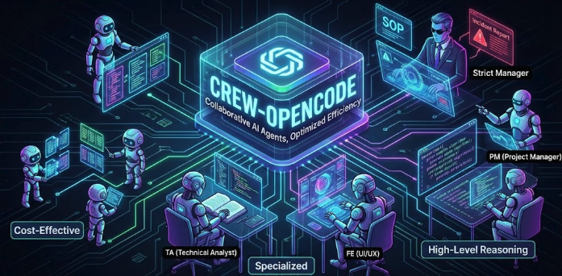

# crew-opencode

> [!NOTE]
>
> 

>**"Low-cost tasks to affordable agents; high-level reasoning to top-tier models."**

[English](README.md) | [한국어](README.ko.md)

## 📑 목차

- [Introduction)](#-introduction)
- [Core Philosophy](#-core-philosophy)
- [The Crew](#-the-crew)
- [Features](#-features)
- [Installation](#-installation)
- [Contributing](#-contributing)

# 🚀 Introduction

**crew-opencode** begins with the keyword **"Collaboration."** Not every agent needs to be an expensive model. We strategically place the right model in the right spot to eliminate token waste and maximize output quality.

The moment you type the `crew` command, you cease to be a simple user and become a Strict Manager. The agents will operate organically, adhering strictly to the procedures and disciplines you have established.

## 💡 Core Philosophy
1.  **Cost-Effective**: Simple, repetitive tasks are delegated to lightweight models, while complex reasoning is reserved for high-performance models.
2.  **Specialization**: Rather than relying on generalists who do "everything," we aim for expert agents specialized in their specific **Roles**.
3.  **Accountability**: When a task fails, a clear root cause analysis (The Apology Letter) is mandatory to prevent recurrence.

## 👥 The Crew
While access to various tools and contexts gives agents versatility, our crew assigns individual agents to specific positions to ensure **Professionalism** and to let them focus only on **what they do best**.

| Role | Position | Model (Example) | Description |
| :--- | :--- | :--- | :--- |
| **PM** | Project Manager | Opus 4.5 | Coordinates parallel team members (agents). Manages product strategy, determines priorities, and executes plans. |
| **TA** | **Technical Analyst** | Claude Sonnet 4.5 | **(New!)** (New!) Conducts research on official documentation (Docs) and open-source implementations, and performs deep analysis of the codebase. |
| **FE** | UI/UX Engineer | Gemini 3 Pro | Develops frontend logic and implements user interfaces reflecting the latest trends. |
| **Design** | Designer | GPT 5.2 Medium | Reviews UI/UX flows and proposes design systems. |
| **QA** | Quality Assurance | Claude Haiku 4.5 | Performs Unit Tests and E2E tests to verify stability and analyze quality. |

---

## ✨ Features

### 1. `crew` Command System
Instruct your agents like a strict department head. Instead of vague commands, you enforce structured Standard Operating Procedures (SOPs) to prevent agents from straying off the path.

### 2. Automated Incident Reports (The 'Apology Letter')
If a team member (agent) encounters an error or stops during a task, they must immediately write an Apology Letter (Incident Report).
* **Root Cause**: Why did it stop?
* **Risk Analysis**: What impact does this error have on the project?
* **Prevention Strategy**: How will we ensure this doesn't happen again?
* *This is not just a log; it is a **Self-Reflection** process for the agent.*

---

## 📦 Installation

OpenCode must be installed first.

```bash
# Install OpenCode first
curl -fsSL https://opencode.ai/install | bash

# Install crew-opencode plugin
bunx crew-opencode install
```

## Quick Start

```bash
# Run with default workflow
opencode

# Or execute a specific workflow
bunx crew-opencode run feature
```

## 🤝 Contributing
We are striving to create a better agent-based coding environment. We acknowledge that our current methods may not be the best, and we eagerly await your wisdom.
- Proposals for new Roles
- Improvements in Prompt Engineering
- Bug reports and fixes
- Etc.

All PRs are welcome. Please join us in becoming a constantly growing organization!

<p align="center"> © 2026 crew-opencode. All rights reserved. </p>
